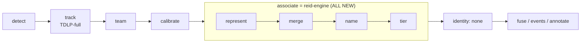
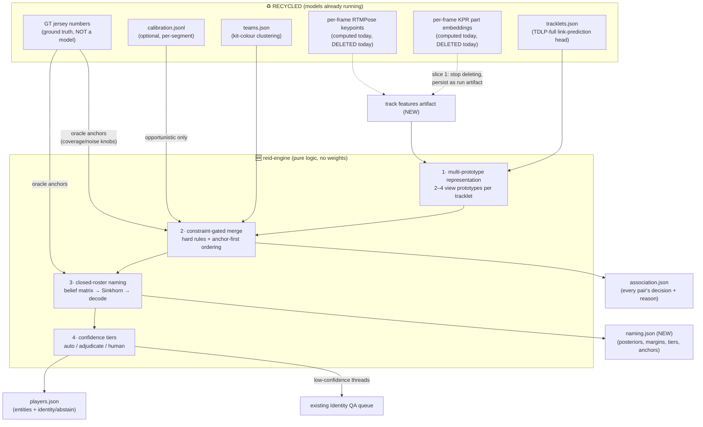
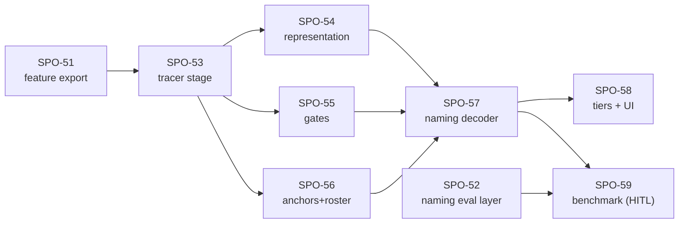

# The Re-ID Engine — an illustrated overview

> Companion illustration for the PRD ([sports-stats#1](https://github.com/hardyjeremy98/sports-stats/issues/1))
> and the Linear project *Re-ID Engine (B2): Merging + Naming* (SPO-51…59).
> Design source: the B2 research direction (stitching + naming). Everything here is research;
> v1 introduces **zero new neural networks**.

## The problem in one picture

The tracker (TDLP-full) turns a match into **anonymous fragments**. The re-ID engine turns
fragments into **named players, or honest "unknown"s** — never silent guesses.

```
tracker output                     re-ID engine output
──────────────                     ───────────────────
tracklet #147  ─┐
tracklet #212  ─┼──► thread ──► "Dave"      (posterior .97, auto-accept)
tracklet #305 ─┘
tracklet #12   ─┬──► thread ──► "#7 Amir"   (posterior .81, adjudicate tier)
tracklet #88  ─┘
tracklet #451  ────► thread ──► ABSTAIN     (evidence too thin → human QA queue)
```

## Where it sits in the pipeline

One composite implementation in the **associate** slot (the identity slot is set to `none` —
naming happens inside the engine, because anchors must inform merging, not decorate it after).



## Data flow: recycled vs new

Solid boxes already exist and are reused unchanged. The **only upstream change** is the TDLP
bridge keeping features it currently computes and deletes (slice 1 / SPO-51).



## The four steps, one line each

| # | Step | What it does | Why |
|---|------|--------------|-----|
| 1 | **Represent** | Cluster each tracklet's per-frame embeddings into 2–4 viewpoint prototypes; compare tracklets part-by-part (only parts visible on both sides) | A mean-pooled embedding makes front-view Dave and back-view Dave look like two people |
| 2 | **Merge** | Agglomerative merging under hard cannot-links: co-occurring ⇒ never; other team ⇒ never; physically impossible travel (camera-motion-compensated) ⇒ never. Anchor-labelled tracklets merge first; conflicting anchors are a cannot-link | The closed-world rules are the superpower — the GSR-winner pattern |
| 3 | **Name** | All anchors speak one currency `(tracklet, roster candidate, log-LR)`; fuse → threads × roster belief matrix → Sinkhorn balancing → decode. Co-occurring threads can never share a name; non-overlapping fragments of one player can | One confident anchor anywhere names a whole thread — and suppresses that name everywhere else |
| 4 | **Tier** | posterior + margin → auto-accept / adjudicate (pass-through interface in v1) / human QA (existing queue) | Abstention is a first-class outcome; silent swaps are the cardinal sin |

## Naming, illustrated

```
              roster (from GT jersey set in v1)
              Dave   Amir   Kofi   …        decision
            ┌──────┬──────┬──────┬───┐
  thread A  │ 0.97 │ 0.01 │ 0.01 │   │  →  "Dave"   (auto-accept)
  thread B  │ 0.02 │ 0.81 │ 0.10 │   │  →  "Amir"   (adjudicate: margin thin)
  thread C  │ 0.33 │ 0.31 │ 0.30 │   │  →  ABSTAIN  (→ human QA)
            └──────┴──────┴──────┴───┘
   Sinkhorn keeps rows/columns balanced: a confident "Dave" on thread A
   automatically pushes "Dave" DOWN on every other thread.
   Constraint: threads that overlap in time can never take the same name.
```

## The oracle anchor trick

Same epistemic move as the existing **oracle detector** (feed GT boxes to isolate tracker
error): feed GT-derived anchors to isolate the *naming engine's* error.

```
GT jersey labels ──► oracle anchor source ──► (tracklet, name, log-LR)
                        knobs:
                        • coverage    (what fraction of tracklets get an anchor)
                        • noise       (probability the anchor lies)
                        • min box px  (stand-in for "close to camera")
                        • seed        (deterministic)
```

Sweeping the knobs through the existing benchmark experiment yields the
**anchor-economics curve** — naming precision @ abstention vs anchor coverage/quality —
the headline research output: it quantifies how good the *future* face-anchor stream must be
**before** any phone footage exists. (Jersey numbers are evaluation truth and synthetic fuel
only — never a pipeline perception input. The no-OCR constraint stands.)

## Measurement

- **One hard gate — do no harm:** vs no-op association on held-out SoccerNet, the engine must
  not lower tracklet purity or entity IDF1/HOTA. (The old colour associator fails exactly
  this: it *added* contamination — entity purity 0.66 vs tracklet 0.91.)
- **Everything else measured, not gated:** stitching gain vs baselines, the anchor-economics
  curve, all via the existing evaluator + a new naming layer
  (roster precision @ abstention vs GT jersey identity).

## Deferred (interfaces ready, no implementation)

Face stack (SCRFD + AdaFace) until footage with visible faces exists · VLM adjudicator
(tier passes through) · split/hygiene stage (merging first; TDLP's rare wrong cross-exit
re-links remain as measured residual impurity) · gait & attribute anchors.

## Build order (Linear slices)



SPO-51 and SPO-52 are independent and grabbable now; SPO-59 is the only human-gated slice
(GPU runs + reading the do-no-harm verdict).
